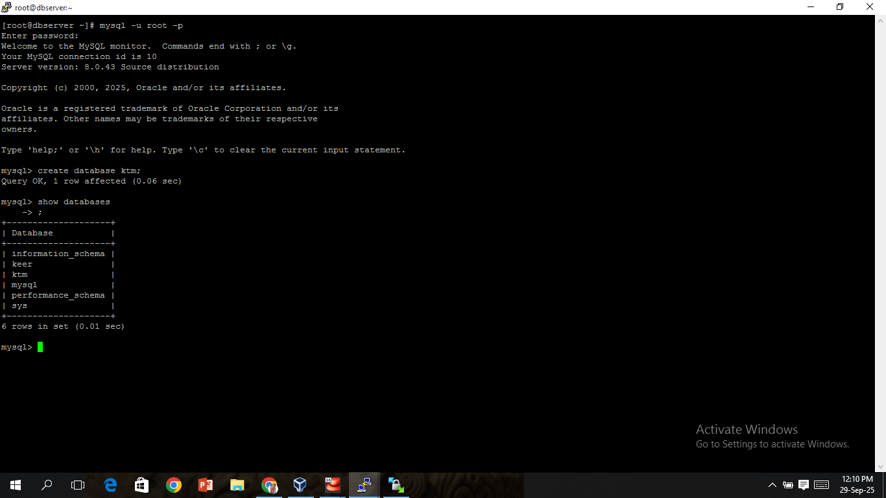
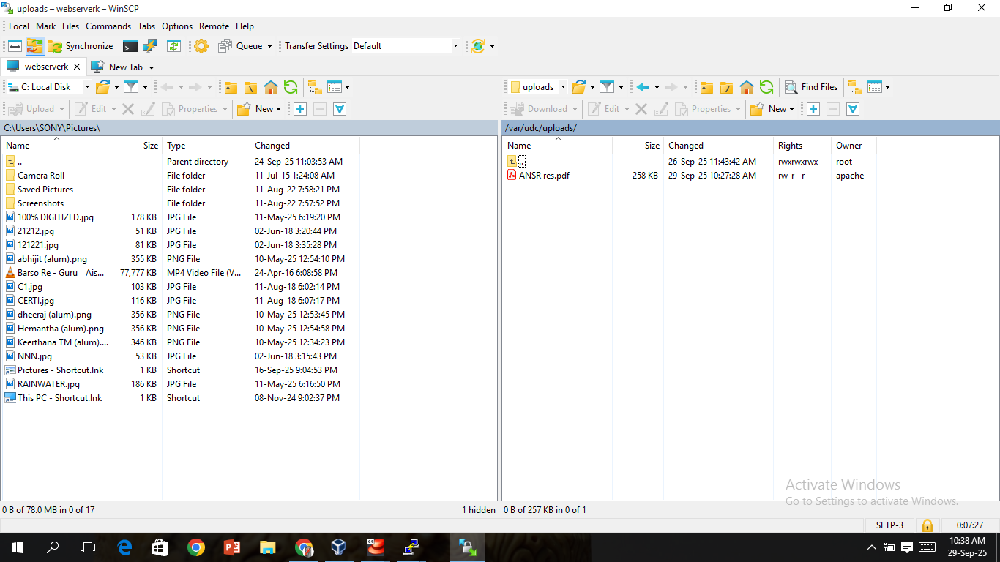
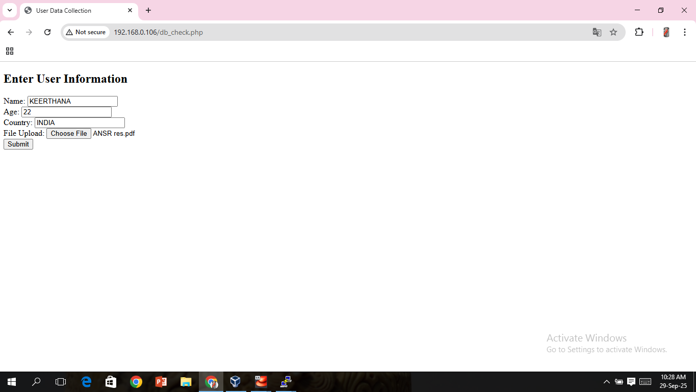
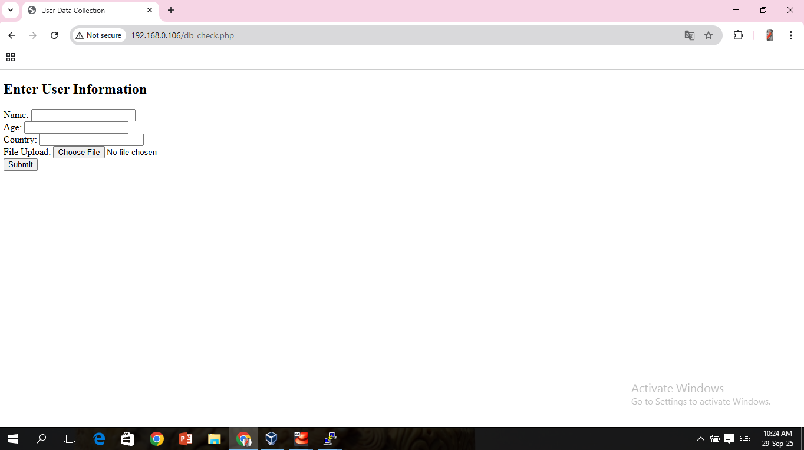
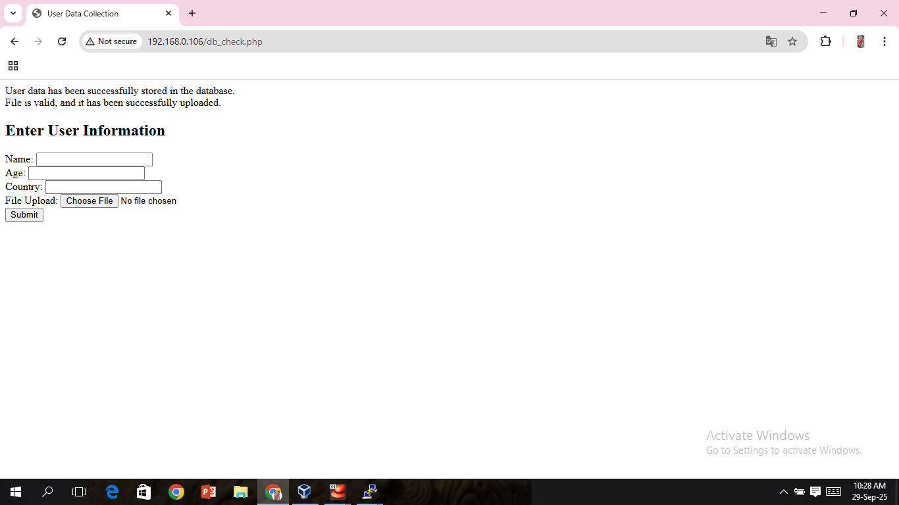

# UDC Project - Installation & Configuration Screenshots

This repository contains **screenshots** for the setup and configuration of the **User Data Collector (UDC) Project**.   
It includes VM setup, database creation, file transfer, and final application testing.

---

## 📸 Screenshots

### 1. Web Server VM

### 2. Database Server VM

### 3. Database Creation

### 4. WinSCP File Transfer

### 5. Data in Database

### 6. Application URL

### 7. After Submission

---

## 📂 Repository Structure
udc-project-screenshots/
├── Project_ScreenShots/
│ ├── WebServer VM.PNG
│ ├── DBServer VM.PNG
│ ├── DB_creation.PNG
│ ├── WinSCP.PNG
│ ├── data.PNG
│ ├── udc_url.PNG
│ └── after_submission.PNG
└── README.md
